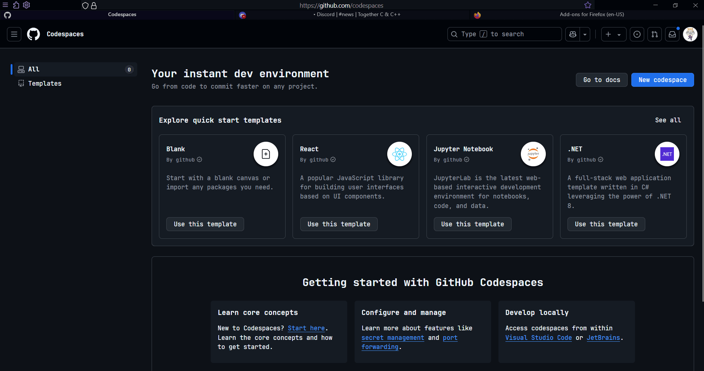

# 🌌 **VoidFOX**

## A Firefox `userChrome.css` theme designed for minimalism and elegance

---

## ✨ **Features**

- **Lightweight** and fast
- **Animated**
- **Customizable** and easy to configure

---

## ⚙️ **Installation**

### 1. **Enable Custom CSS**

> - Open `about:config` in the URL bar and press Enter.
> - If prompted, **_click I accept the risk_**
> - Search for `toolkit.legacyUserProfileCustomizations.stylesheets` and set it to **true**

### 2. **Locate Your Firefox Profile Folder**

> - **Windows**: `C:\Users\[USERNAME]\AppData\Roaming\Mozilla\Firefox\Profiles\[PROFILE]`
> - **MacOS**: `Users/[USERNAME]/Library/Application Support/Firefox/Profiles/[PROFILE]`
> - **Linux**: `$HOME/.mozilla/firefox/[PROFILE]`

### 3. **Copy the CSS Files**

> - Copy the entire **chrome** folder into your Firefox profile folder
> - Restart Firefox to apply the theme

### 4. **Customize (Optional)**

> - Open and edit the CSS files in the **chrome** folder to tailor the look to your preferences

## That's it!

---

## 🌟 **Bonus:**

For better look, also install the **[Adaptive Tab Bar Color](https://addons.mozilla.org/en-US/firefox/addon/adaptive-tab-bar-color/)** extension!

---

## 📜 **License**

This project is licensed under the **MIT License**

---

# 🦊 **Embrace the Void — Browse Beyond!**
